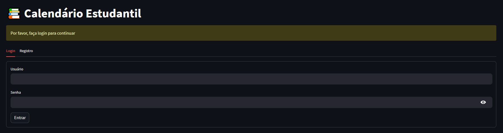
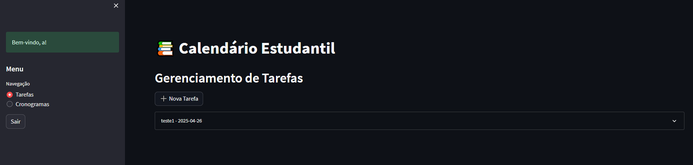

# Calendário Estudantil

Aplicação para organização de atividades acadêmicas desenvolvida com Streamlit, permitindo o gerenciamento eficiente de tarefas e cronogramas de estudo.

## Capturas de Tela





## Sobre o Projeto

O Calendário Estudantil é uma aplicação web que auxilia estudantes na organização de suas atividades acadêmicas. Desenvolvido com Streamlit, oferece uma interface intuitiva para gerenciar tarefas e cronogramas de estudo de forma eficiente.

## Funcionalidades

### Gerenciamento de Tarefas
- Criação de novas tarefas com título, descrição, data de entrega e prioridade
- Edição de tarefas existentes
- Exclusão de tarefas
- Visualização organizada por data de entrega

### Cronogramas de Estudo
- Criação de cronogramas semanais
- Definição de horários específicos para cada atividade
- Seleção de dias da semana para cada cronograma
- Edição e exclusão de cronogramas

### Sistema de Autenticação
- Registro de novos usuários
- Login seguro com autenticação por token
- Proteção de dados pessoais
- Gerenciamento de sessão

## Requisitos

- Python 3.8 ou superior
- pip (gerenciador de pacotes Python)

## Tecnologias Utilizadas

- **Streamlit**: Framework para desenvolvimento de aplicações web com Python
- **SQLite**: Banco de dados local para armazenamento de informações
- **Python-dotenv**: Gerenciamento de variáveis de ambiente

## Instalação

1. Clone o repositório:
   ```bash
   git clone https://github.com/MatheusOtenio/Student-Calendar-FullStack.git
   cd Student-Calendar-FullStack
   ```

2. Instale as dependências:
   ```bash
   pip install -r requirements.txt
   ```

## Configuração

A aplicação utiliza um banco de dados SQLite local que é criado automaticamente na primeira execução. Não é necessária configuração adicional para iniciar o uso.

## Execução

Para iniciar a aplicação, execute:
```bash
streamlit run main.py
```

A aplicação estará disponível em `http://localhost:8501`

## Estrutura do Projeto

- `main.py`: Arquivo principal da aplicação, contém a interface e o fluxo de navegação
- `auth.py`: Módulo de autenticação, responsável pelo registro, login e gerenciamento de sessão
- `tasks.py`: Gerenciamento de tarefas, implementa as operações CRUD para tarefas
- `schedules.py`: Gerenciamento de cronogramas, implementa as operações CRUD para cronogramas
- `database.py`: Configuração e operações do banco de dados SQLite
- `requirements.txt`: Lista de dependências do projeto

## Testes

Para executar os testes da aplicação:
```bash
python -m unittest test_main.py
```

## Contribuição

1. Faça um fork do projeto
2. Crie uma branch para sua feature (`git checkout -b feature/nova-funcionalidade`)
3. Faça commit das suas alterações (`git commit -m 'Adiciona nova funcionalidade'`)
4. Faça push para a branch (`git push origin feature/nova-funcionalidade`)
5. Abra um Pull Request
